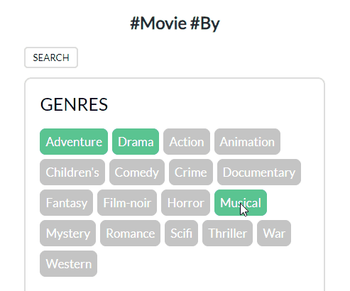

# VIM PROJECTOR (CSE364_Group10)


> ### ***Find Very Impressive Movies, VIM PROJECTOR***

<br>

## Introduction

`VIM PROJECTOR` is a **movie recommendation service** which recommends **Very Impressive Movies** according to given conditions.  
Here are three functions of `VIM PROJECTOR`.  

1. **Recommendation by User Information😊**  
    > Give the `genres` you wish to watch and your `gender`, `age` and `occupation`.  
    > Then you will receive a list of  **10 recommended movies** that belong to the given genres.  
    > To see the list of available input, refer to [here](#Input-User-Information).  

2. **Recommendation by Movie Title🎞️**  
    > Give a `movie title` and the `number of movies` you wish to be recommended.  
    > Then you will get the given number of movies similar to the one you gave us.  
    > To see more detail of inputs, refer to [here](#Input-Movie-Information).  
   
3. **Feeling Lucky🍀**    
    > Sometimes, recommendations in a similar way can be boring for you.  
    > Just click `feeling lucky`, then you will get the randomly recommended movie.  
    > Find the unpopular but unexpectedly impressive movie!  

<br>

We provide **web service** and **RESTful API** for `VIM PROJECTOR`.  
To see the guide for web page, refer to [here](#Introduction).  
**here 위치 web page guide로 바꿔야 함**

Using `VIM PROJECTOR` will give you a list of recommended movies with information such as titles, genres, and links to imdb.
Also, it will give you random movie    
Find your next movie to watch with `VIM PROJECTOR`!!!  

If you want more information about our **recommendation algorithm**, please see [here](#Recommendation-Algorithm).  


<br>
<br>


## Index

+ [Introduction](#Introduction)
+ [Index](#Index)
+ [Installation](#Installation)
+ [Webpage Guide](#Webpage-Guide)
+ [API Guide](#API-Guide)
    + [Common](#Common)
    + [Input User Information](#Input-User-Information)
    + [Input Movie Information](#Input-Movie-Information)
+ [Recommendation Algorithm](#Recommendation-Algorithm)
    + [Abstract](#Abstract)
    + [Details](#Details)
+ [Contributors](#Contributors)

<br>
<br>


## Webpage Guide 


### Home👋

> ***Provide the Best User Experience***  
> ***Welcome to webpage of VIM PROJECTOR!***  
> 
> Top 10 movies welcome you!  
> For more service, click other tabs: `#Movie`, `#User`, `#Feeling Lucky`  
>
> 

<br>

### Movie🎞️

> Type **movie title** and limit  
> Then, click the title  
> `VIM PROJECTOR` recommends you highly rated movies based on given movie title.  
> 
>  | 
> :---:|:---:
> Page Overview | Type Movie Title (Auto-complete supported)

<br>

### User😊

> Select **hashtag**  
> Then, click the search button  
> `VIM PROJECTOR` recommends you top 10 movies based on given user information.  
>
>  |  
> :---:|:---:
> Page Overview | Select Hashtag

<br>

### Feeling Lucky🍀

> Are you struggling with selecting movie?  
> **Feeling Lucky** is the answer!  
> 
> 
> :---:
> Page Overview

<br>

### Recommendation Page

> For more information on recommended movie, **just click the poster!**  
> It will take you `imdb` site  
>
>  | 
> :---:|:---:
> Scroll | Resize


## Installation

`Java(version 11 or up)`, `Git`, `curl` and `Maven` installation must be preceded before installing and running this program.  
To install and this program, run the commands below, or run the [`run.sh`](./run.sh) file that is included in the repository.  
```
$ git clone https://github.com/csathenaryu/CSE364_Group10.git
$ git pull origin main
$ git checkout main
$ mvn package
$ java -jar target/CSE364-project-0.0.1-SNAPSHOT/
```

Please refer to the following sections about details in [calling this API](#API-Guide).
<br>
<br>
<br>


## Using the REST API
This document shows you how to perform movie recommendations
You can test it with `curl`  


### Calling the API

<br>

**[Request]**
- Input of GET request should be in **JSON** type.  
- Please refer to `list of available input`. The input which is not in the list might be ignored or miscategorized.  
- **Capitalization** does not matter. However, in the case of `movie title`, capitalization does matter.  
- Please **avoid spelling mistakes.** This program does not provide any fool-proof feature for such mistakes.  

<br>


### Recommendation based on User Information

**API Basic Information**
|Method|Request URL|Content Type|Output Format|
|:---|:---|:---|:---|
|GET|http://localhost:8080/users/recommendations|application/x-www-form-urlencoded|JSON|

<br>
  
**Request Parameters**
|Name|Required|Default Value|Description|
|:---|:---|:---|:---|
|gender|mandatory|All genders|Available genders: `m`, `f`<br>- Wanted gender<br>- Leave this field blank for default option|
|age|mandatory|All ages|Available ages: `0 or higher integer`<br>- Wanted age<br>- Leave this field blank for default option<br>- Ages that are not integer or negative will be ignored|
|occupation|mandatory|All occupations|Available occupations: `academic`, `educator`, `artist`, `clerical`, `admin`, `collegestudent`, `gradstudent`, `customerservice`, `doctor`,`healthcare`, `executive`, `managerial`, `farmer`, `homemaker`, `k-12student`, `lawyer`, `programmer`, `retired`, `sales`, `marketing`, `scientist`, `self-employed`, `technician`, `engineer`, `tradesman`, `craftsman`, `unemployed`, `writer`, `other`<br>- Watned occupation<br>- Leave this field blank for default option<br>- Wrong occupations will be categorized as `other`|
|genres|mandatory|All genres|Available genres: `action`, `adventure`, `animation`, `children's`, `comedy`, `crime`, `documentary`, `drama`, `fantasy`, `film-noir`, `horror`, `musical`, `mystery`, `romance`, `scifi`, `thriller`, `war`, `western`<br>- Wanted genres<br>- Leave this field blank for default option<br>- In case you are entering several genres, please distinguish each genre by delimiter `\|` <br>- Wrong genres and repeated inputs will be ignored<br>- If there is no valid genre input, the program will search movie regardless of genres|

<br>

**Response Body**
|Key|Type|Description|
|:---|:---|:---|
|title|string|Titles of recommended movies|
|genres|string|Genres of recommended movies|
|imdb|string|Link of receommended movies|
|poster_url|string|Link of poster of receommended movies|

<br>


**Sample Request**
```
curl -X GET http://localhost:8080/users/recommendations?gender=m&age=24&occupation=gradstudent&genres=action|adventure
```
<br>
  
**Sample Response**
```
[{
    "title": "xxx",
    "genres": "xxx",
    "imdb": "(https://www.imdb.com/title/ttXXXXXXX)"
    "poster_url": https://xxx/xxx.jpg

},
{
    "title": "xxx",
    "genres": "xxx",
    "imdb": "(https://www.imdb.com/title/ttXXXXXXX)"
    "poster_url": https://xxx/xxx.jpg
},
...]
```
<br>
<br>
<br>


### Recommendation based on Movie Information

**API Basic Information**
|Method|Request URL|Content Type|Output Format|
|:---|:---|:---|:---|
|GET|http://localhost:8080/movies/recommendations|application/x-www-form-urlencoded|JSON|

<br>


**Request Parameters**
|Name|Required|Default Value|Description|
|:---|:---|:---|:---|
|title|mandatory|-|- Capitalization does matter<br>- ISO-8859-15 encoding required<br>- If input title is invalid, the program will recommend highly rated movies|
|limit|mandatory|10|Available limit: `1 or higher integer`<br>- Number of recommended movies<br>- If limit is zero or negative, the program will recommend 10 movies|

<br>

**Response Body**
|Key|Type|Description|
|:---|:---|:---|
|title|string|Titles of recommended movies|
|genres|string|Genres of recommended movies|
|imdb|string|Link of receommended movies|
|poster_url|string|Link of poster of receommended movies|

<br>


**Sample Request**
```
curl -X GET http://localhost:8080/users/recommendations?title=Sanjuro+(1972)&limit=20
```
<br>
  
**Sample Response**
```
[{
    "title": "xxx",
    "genres": "xxx",
    "imdb": "(https://www.imdb.com/title/ttXXXXXXX)"
    "poster_url": https://xxx/xxx.jpg

},
{
    "title": "xxx",
    "genres": "xxx",
    "imdb": "(https://www.imdb.com/title/ttXXXXXXX)"
    "poster_url": https://xxx/xxx.jpg
},
...]
```
<br>
<br>
<br>


### Feeling Lucky

**API Basic Information**
|Method|Request URL|Content Type|Output Format|
|:---|:---|:---|:---|
|GET|http://localhost:8080/feelinglucky/recommendations|application/x-www-form-urlencoded|JSON|

<br>


**Response Body**
|Key|Type|Description|
|:---|:---|:---|
|title|string|Titles of recommended movies|
|genres|string|Genres of recommended movies|
|imdb|string|Link of receommended movies|
|poster_url|string|Link of poster of receommended movies|

<br>


**Sample Request**
```
curl -X GET http://localhost:8080/feelinglucky/recommendations
```
<br>


**Sample Response**
```
[{
    "title": "xxx",
    "genres": "xxx",
    "imdb": "(https://www.imdb.com/title/ttXXXXXXX)"
    "poster_url": https://xxx/xxx.jpg

},
{
    "title": "xxx",
    "genres": "xxx",
    "imdb": "(https://www.imdb.com/title/ttXXXXXXX)"
    "poster_url": https://xxx/xxx.jpg
},
...]
```
<br>
<br>
<br>


### Get All Movie Information

**API Basic Information**
|Method|Request URL|Content Type|Output Format|
|:---|:---|:---|:---|
|GET|http://localhost:8080/movies|application/x-www-form-urlencoded|JSON|

<br>


**Response Body**
|Key|Type|Description|
|:---|:---|:---|
|title|string|Titles of recommended movies|
|genres|string|Genres of recommended movies|
|imdb|string|Link of receommended movies|
|poster_url|string|Link of poster of receommended movies|

<br>


**Sample Request**
```
curl -X GET http://localhost:8080/movies
```
<br>


**Sample Response**
```
[{
    "title": "xxx",
    "genres": "xxx",
    "imdb": "(https://www.imdb.com/title/ttXXXXXXX)"
    "poster_url": https://xxx/xxx.jpg

},
{
    "title": "xxx",
    "genres": "xxx",
    "imdb": "(https://www.imdb.com/title/ttXXXXXXX)"
    "poster_url": https://xxx/xxx.jpg
},
...]
```
<br>
<br>


### Get Movie Title List

**API Basic Information**
|Method|Request URL|Content Type|Output Format|
|:---|:---|:---|:---|
|GET|http://localhost:8080/movies/title|application/x-www-form-urlencoded|string|

<br>


**Sample Request**
```
curl -X GET http://localhost:8080/movies/title
```
<br>


**Sample Response**
```
["Movie Title (xxxx)", "Movie Title 2 (xxxx)", ...]
```
<br>
<br>


## Recommendation Algorithm

### Abstract
The criteria for recommending movies in `VIM PROJECTOR` are `rating` and `count`.  

- `rating` is the average score of a movie that belongs to `genres` you input (`target genres`) and is rated by users belonging to your categories of `gender`, `age`, and `occupation` (`target users`).  
- `count` is the number of ratings of a movie that belongs to the target genres and rated by the target users.  

In our algorithms, movies with **high rating averages** will be selected as recommendations. In each step in the algorithms, rating data of the movies that fit the conditions (`target movies`) will be processed and sorted. Top N movies in the sorted list will be selected to be recommended, with N being the number of movies required.  

For a movie to be recommended, the `rating average` of a movie must be **equal or above 3.5**, and the `count` of the movie must be **equal or above 1%** of the number of total rating data.  
<br>


### Details

`VIM PROJECTOR` uses two different movie recommendation algorithms depending on different inputs, `user information` and `movie information`.  

1. Input `user information`  

    By `user information`, we mean your `gender`, `age`, `occupation` and `genres` you wish to watch.
    When given `user information`, `VIM PROJECTOR` will recommend movies that are in the `target genres` and have high ratings by `target users`.  
    The steps in this algorithm are shown below.  

    1.  Generate a list of 10 recommended movies that are in the `target genres` and are rated highly by `target users`. If `target genres` are not given, the algorithm will search for and recommend movies in all genres.  
    2.  If the number of movies in the generated list is less than 10, then expand the range of `target users` by expanding the range of `occupation` to **all occupations** and search again. Then add the recommended movies to the list.      
    3.  If the number of movies in the generated list is still less than 10, then expand the range of `target users` again by expanding the range of `age` to **all age groups** and search again. Then add the recommended movies to the list.  
    4.  If the number of movies in the generated list is still less than 10, then expand the range of `target users` once more by expanding the range of `gender` to **all genders** and search again. Then add the recommended movies to the list.
    <br>
    <details>
    <summary>See an example</summary>
    <div markdown="1">

    Let’s see an example of {`gender`: “m”, `age`: “56”, `occupation`: “k-12student”, `genres`: “” } given as an input of `user information`. Since the genres field is not given, movies in all genres will be the candidates for recommendation.

    According to this algorithm, the generation of a movie recommendation list would follow the process shown below.

    1.  A list of recommended movies is generated using the given `target user` data and `target genres` data. In this example, there is only one `target user`. The number of movies contained in this list of recommended movies is less than 10.
    2.  Since there are less than 10 movies in the list, expand the range of `target users` by allowing the search for **all occupations**. Now the conditions for the `target users` would be {`gender`: “m”, `age`: “56”, `occupation`: “”, `genres`: “” }. Add the recommended movies based on the new range of `target users`.
    3.  If the number of movies in the generated list is still less than 10, then expand the range of `target users` by allowing the search for **all age groups**. Now the conditions for the `target users` would be {`gender`: “m”, `age`: “”, `occupation`: “”, `genres`: “” }. Add the recommended movies based on the new range of `target users`.
    4.  If the number of movies in the generated list is still less than 10, then expand the range of `target users` by allowing the search for **all genders**. Now the conditions for the `target users` would be {`gender`: “”, `age`: “”, `occupation`: “”, `genres`: “” }. Add the recommended movies based on the new range of `target users`.

    </div>
    </details>
    
<br>

2. Input `movie information`  

    By `movie information`, we mean a `movie title` and a `limit number`. When given `movie information`, `VIM PROJECTOR` will recommend high-rated movies similar to the given movie and up to the given `limit number`. The similarity of the movies are assessed by the `genres` of the movies.
    The steps in this algorithm are shown below.

    1.  Generate a list of recommended movies that are in the **same genres** as the given movie.
    2.  If the number of movies in the generated list is less than the given `limit number`, add the recommended movies that belong to genres that **include all the genres** of the given movie to the list.
    3.  If the number of movies in the generated list is still less than the given `limit number`, add the recommended movies that belong to **at least one genre** of the given movie.
    4.  If the number of movies in the generated list is still less than the given `limit number`, add the recommended movies that belong to **all genres**.
    <br>
    <details>
    <summary>See an example</summary>
    <div markdown="1">

    Let’s see an example of {`title`: “Toy Story (1995)”, `limit`: 20} given as an input of `movie information`. The `genres` of this movie are `Animation`, `Children's`, and `Comedy`. A list of 20 recommended movies should be generated.

    According to this algorithm, the generation of a movie recommendation list would follow the process shown below.

    1.  A list of recommended movies is generated from the data of movies that only belong to all three `genres` of `Animation`, `Children's`, and `Comedy` at once. The generated list contains only one movie.
    2.  Then recommendations are searched within the data of movies that belong to all three `genres` and more. One such example would be a movie that belongs to `genres` of `Animation`, `Children’s`, `Comedy` and `Action`. However, in this case there are no movies added to the list.
    3.  Now the recommendations are searched from the data of movies that belong to at least one `genre` of the given three `genres`. This means that the recommended movies could belong to any one `genre` from `Animation`, `Children’s`, or `Comedy`, or to any two of these `genres`. In this example, there are 19 movies added to the generated list.
    4.  In this example, the list of 20 recommended movies is now generated. However, if the number of movies in the generated list is still less than the given `limit number`, add the recommended movies that belong to **all genres**.

    </div>
    </details>
    
<br>
<br>

## Contributors

|NAME<br>(STUDENT ID)|ROLE|
|:----|:--------|
|박소연<br>(20171113)|[Milestone 1]<br>- Suggested algorithm utilizing boolean ArrayList<br>- Implemented code that receives boolean ArrayList as input and returns Rating as output<br>[Milestone 2]<br>- Implemented 'recommender' package<br>- Implemented 'recommender' package test codes<br>[Milestone 3]<br>- Implemented 'Mileston2Test' and 'Milestone3Test'<br>- Edit 'Milestone2' and 'Milestone3' for include limit parameter|
|안종민<br>(20171155)|[Milestone 1]<br>- Implemented code that processes parsed data as a boolean ArrayList<br>- Edited Pom.xml<br>[Milestone 2]<br>- Implemented 'parsinginputargs' package<br>- Implemented 'loadingdata' package test codes<br>[Milestone 3]<br>- Edit Docker for Milestone3<br>- Implement 'loadingdata' package test codes<br>- Reimplemented 'TopRating' class|
|류성화<br>(20171375)|[Milestone 1]<br>- Implemented code that processes parsed data as a boolean ArrayList<br> - Translated README.md<br>[Milestone 2]<br>- Implemented 'recommender' package<br>- Implemented 'Milestone2.java' test codes<br>[Milestone3]<br>- Applied Spring framework<br>- Implemented 'Milestone3'<br>- Add 'stringStringloadHashFrom' method in 'FilePreprocessing.java' to get genres by title|
|김혜진<br>(20181072)|[Milestone 1]<br>- Implemented code that receives and parses arguments as inputs<br>- Wrote first draft of README.md<br>[Milestone 2]<br>- Implemented 'loadingdata' package<br>- Implemented 'customdatastructure' and 'parsinginputargs' package test codes<br>[Milestone3]<br>- Implemented 'FilteringDataByCondition'<br>- Implemented 'FilteringDataByCondition' test codes|

<br>
<br>
<br>
